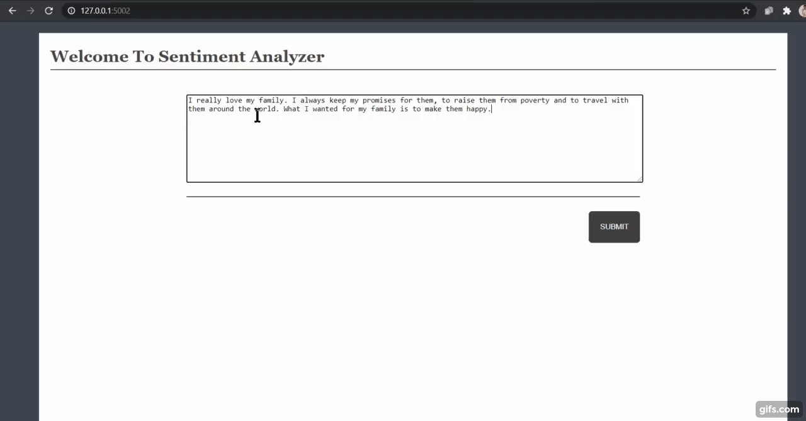

# Sentiment-Analysis-ML-Flask-App
A machine learning end to end flask web app for sentiment analysis model created using Scikit-learn &amp; VADER Sentiment.  
The project uses libraries like :  
Flask  
Sklearn  
Requests  
NLTK  
RE  
vaderSentiment  

### Live Link : https://sentiment-analysis-x.herokuapp.com/  ###

### VADER SENTIMENT  
VADER (Valence Aware Dictionary and sEntiment Reasoner) is a lexicon and rule-based sentiment analysis tool that is specifically attuned to sentiments expressed in social media, and works well on texts from other domains.  
More about [VADER](https://pypi.org/project/vaderSentiment/)
 
 
### LET'S TALK ABOUT SENTIMENT ANALYSIS  
Sentiment analysis, an important area in Natural Language Processing, is the process of automatically detecting affective states of text. Sentiment analysis is widely applied to voice-of-customer materials such as product reviews in online shopping websites like Amazon, movie reviews or social media. It can be just a basic task of classifying the polarity of a text as being positive/negative or it can go beyond polarity, looking at sentiment states etc.  
Sentiment analysis refers to analyzing an opinion or feelings about something using data like text or images, regarding almost anything. Sentiment analysis helps companies in their decision-making process. For instance, if public sentiment towards a product is not so good, a company may try to modify the product or stop the production altogether in order to avoid any losses.  

There are many sources of public sentiment e.g. public interviews, opinion polls, surveys, etc. However, with more and more people joining social media platforms, websites like Facebook and Twitter can be parsed for public sentiment.  
 
The output looks like :  

### Novelty :   ###

- In today’s environment where we’re suffering from data overload (although this does not mean better or deeper insights), companies might have mountains of customer feedback collected. Yet for mere humans, it’s still impossible to analyze it manually without any sort of error or bias. 

- Sentiment analysis provides answers into what the most important issues are. Because sentiment analysis can be automated, decisions can be made based on a significant amount of data rather than plain intuition that isn’t always right. 

- By using sentiment analysis and automating this process, we can easily drill down into different customer segments of our business and get a better understanding of sentiment in these segments. 
